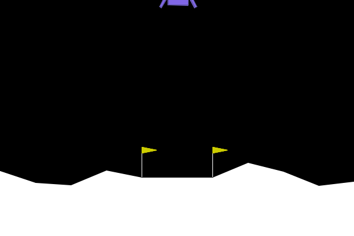

# dqn-lunarlander
## DQN Agent for LunarLander-v2 🚀

This repository contains an implementation of a Deep Q-Network (DQN) agent to solve OpenAI Gym's `LunarLander-v2` environment using TensorFlow 2.x.

---

## 🛠️ Environment Setup

### 1. Clone the repository

If you have Git installed, run:

```bash
git clone https://github.com/worm-code/dqn-lunarlander.git
cd dqn-lunarlander
```

Or download the ZIP file from the repository and unzip it to your target directory.

---

### 2. Install Miniconda (recommended)

We recommend using Miniconda to manage your Python virtual environments. You can download it from the official site:

https://docs.conda.io/en/latest/miniconda.html

Or (recommended)
Check this CSDN site:

https://blog.csdn.net/AlgoZZi/article/details/145074821

After installation, open your terminal (or Anaconda Prompt on Windows) and create a new environment:

```bash
conda create -n dqn-lunar python=3.9
conda activate dqn-lunar
```

---

### 3. Install dependencies

Install Python packages with:
```bash
pip install -r requirements.txt
```

---


## 🚀 Training the DQN Agent

To train the agent, run:
```python
python train.py
```
### 📌 Training Hyperparameters

These are the key parameters in `train.py`:
```
ALPHA = 0.001             # Learning rate for the optimizer
gamma = 0.995             # Discount factor for future rewards
NUM_STEPS_FOR_UPDATE = 4  # Frequency of training step execution
memory_size = 100000      # Replay buffer size
epsilon = 1.0             # Initial epsilon for exploration
num_episode = 1000        # Total number of training episodes
max_num_timesteps = 1000  # Max steps per episode
MINIBATCH_SIZE = 64       # Size of sampled batch from memory
TAU = 1e-3                # Soft update rate for target network
num_av = 100              # Window size for average score calculation
```

During training, a model will be saved to:
```
model_weight_path = 'lunar_lander_model.h5'
```
---

## 👁️ Visualizing the Trained Agent

After training, run the visualization script to test the agent’s performance:
```python
python visualize.py
```
This will:
- Load the trained model from `lunar_lander_model.h5`
- Run one episode of `LunarLander-v2` with human rendering
- Print the total reward the agent achieved

---

## 📊 Final Results

You can view the final training performance and a demo of the trained agent here:

- Training Curve: ./training_curve.png
- Final Result GIF:



These will be uploaded after training is complete.

---

## 📚 Want to Learn More About the Environment?

You can learn more about the `LunarLander-v2` environment in the OpenAI Gym documentation:

https://www.gymlibrary.dev/environments/box2d/lunar_lander/
